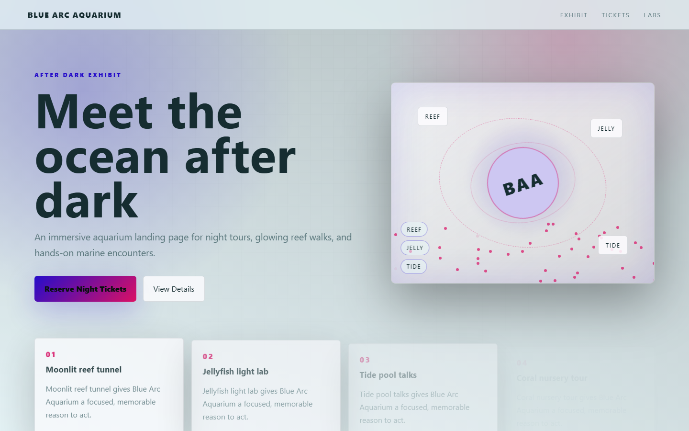

# Blue Arc Aquarium - Deep Sea Nights



An immersive aquarium landing page for night tours, glowing reef walks, and hands-on marine encounters.

## Quick Start

Open `index.html` in your browser.

```bash
# Windows PowerShell
start index.html
```

## Project Structure

```text
aquarium-exhibit/
|-- index.html
|-- style.css
|-- script.js
|-- screenshot.png
`-- README.md
```

## Features

- Moonlit reef tunnel
- Jellyfish light lab
- Tide pool talks
- Coral nursery tour

## Tech Stack

- HTML5
- CSS3
- JavaScript
