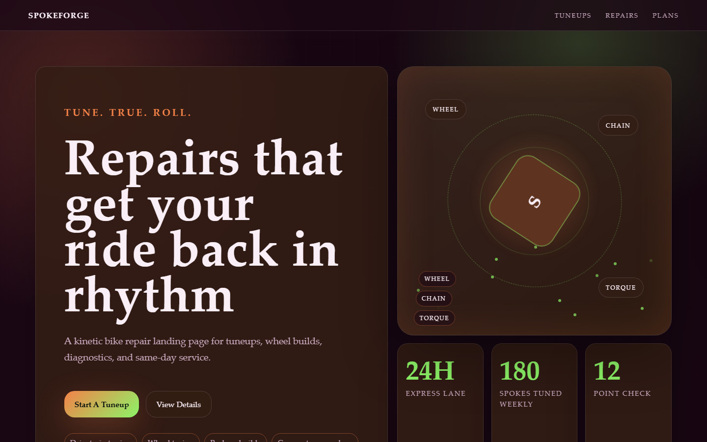

# SpokeForge - Bicycle Repair



A kinetic bike repair landing page for tuneups, wheel builds, diagnostics, and same-day service.

## Quick Start

Open `index.html` in your browser.

```bash
# Windows PowerShell
start index.html
```

## Project Structure

```text
bicycle-repair/
|-- index.html
|-- style.css
|-- script.js
|-- screenshot.png
`-- README.md
```

## Features

- Drivetrain tuning
- Wheel truing
- Brake rebuilds
- Commuter care plans

## Tech Stack

- HTML5
- CSS3
- JavaScript
