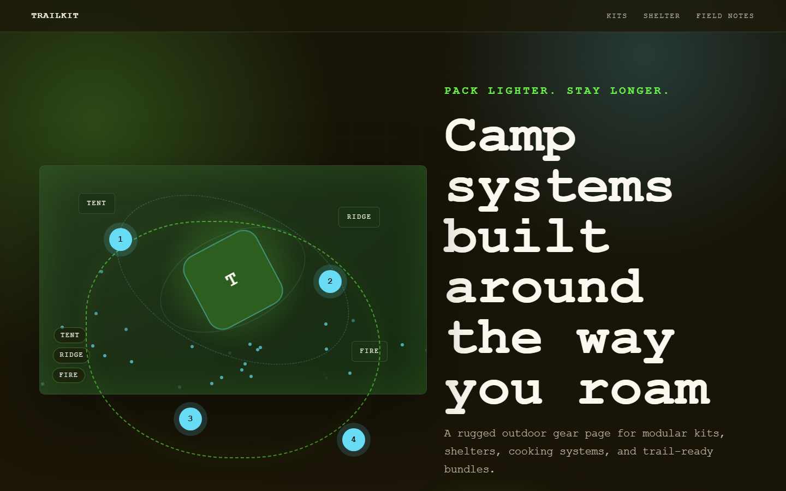

# Trailkit - Modular Camping Gear



A rugged outdoor gear page for modular kits, shelters, cooking systems, and trail-ready bundles.

## Quick Start

Open `index.html` in your browser.

```bash
# Windows PowerShell
start index.html
```

## Project Structure

```text
camping-gear/
|-- index.html
|-- style.css
|-- script.js
|-- screenshot.png
`-- README.md
```

## Features

- Snap-together packs
- Stormproof shelter
- Compact field kitchen
- Repairable hardware

## Tech Stack

- HTML5
- CSS3
- JavaScript
