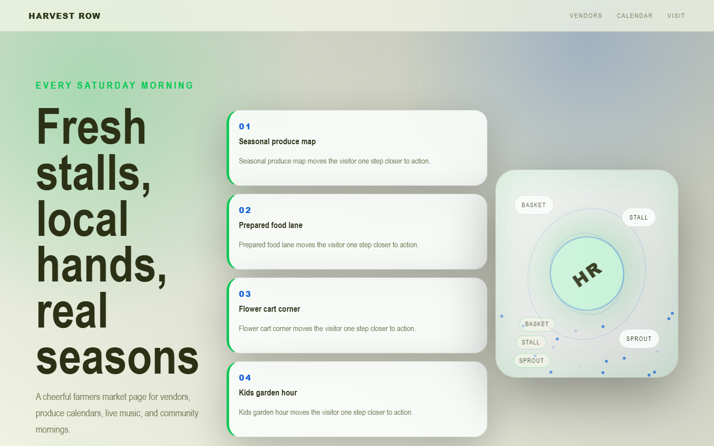

# Harvest Row - Farmers Market



A cheerful farmers market page for vendors, produce calendars, live music, and community mornings.

## Quick Start

Open `index.html` in your browser.

```bash
# Windows PowerShell
start index.html
```

## Project Structure

```text
farmers-market/
|-- index.html
|-- style.css
|-- script.js
|-- screenshot.png
`-- README.md
```

## Features

- Seasonal produce map
- Prepared food lane
- Flower cart corner
- Kids garden hour

## Tech Stack

- HTML5
- CSS3
- JavaScript
