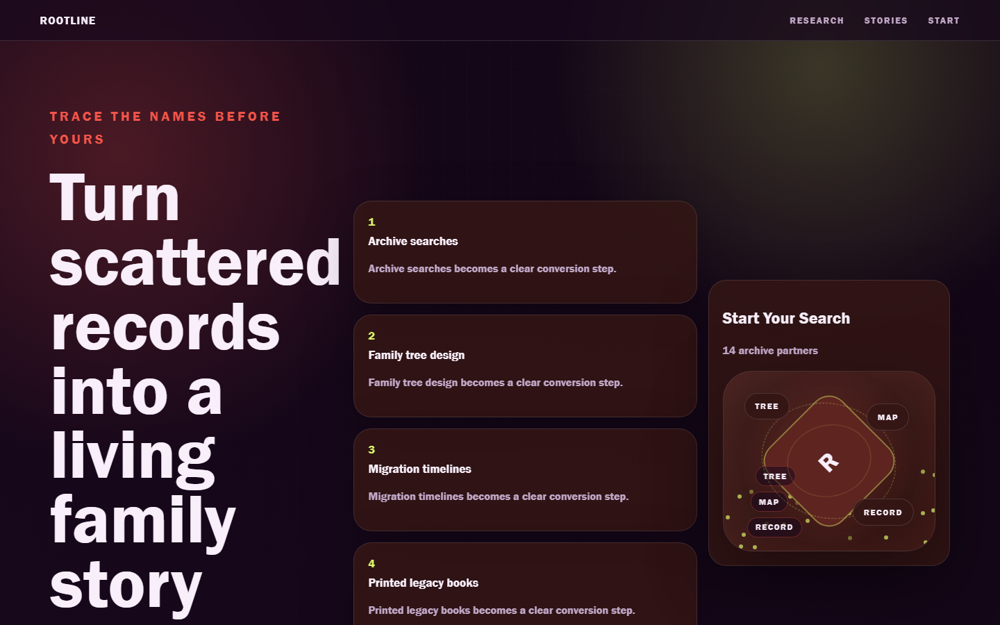

# Rootline - Family History



A thoughtful genealogy page for archive research, family trees, DNA context, and heirloom books.

## Quick Start

Open `index.html` in your browser.

```bash
# Windows PowerShell
start index.html
```

## Project Structure

```text
genealogy-service/
|-- index.html
|-- style.css
|-- script.js
|-- screenshot.png
`-- README.md
```

## Features

- Archive searches
- Family tree design
- Migration timelines
- Printed legacy books

## Tech Stack

- HTML5
- CSS3
- JavaScript
