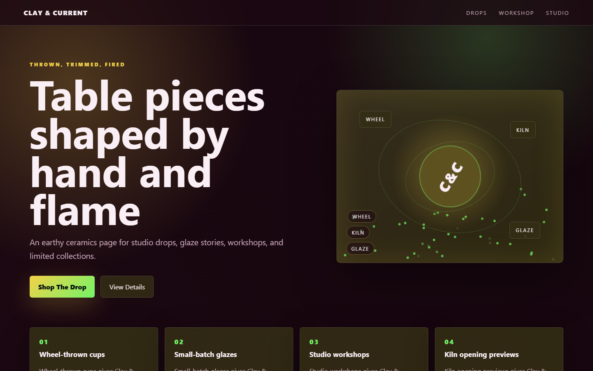

# Clay & Current - Handmade Ceramics



An earthy ceramics page for studio drops, glaze stories, workshops, and limited collections.

## Quick Start

Open `index.html` in your browser.

```bash
# Windows PowerShell
start index.html
```

## Project Structure

```text
handmade-ceramics/
|-- index.html
|-- style.css
|-- script.js
|-- screenshot.png
`-- README.md
```

## Features

- Wheel-thrown cups
- Small-batch glazes
- Studio workshops
- Kiln opening previews

## Tech Stack

- HTML5
- CSS3
- JavaScript
