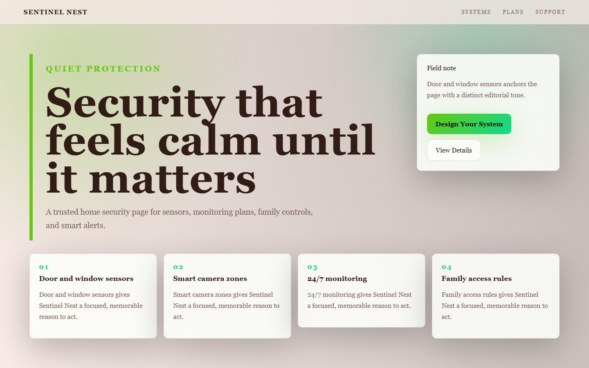

# Sentinel Nest - Home Security



A trusted home security page for sensors, monitoring plans, family controls, and smart alerts.

## Quick Start

Open `index.html` in your browser.

```bash
# Windows PowerShell
start index.html
```

## Project Structure

```text
home-security/
|-- index.html
|-- style.css
|-- script.js
|-- screenshot.png
`-- README.md
```

## Features

- Door and window sensors
- Smart camera zones
- 24/7 monitoring
- Family access rules

## Tech Stack

- HTML5
- CSS3
- JavaScript
