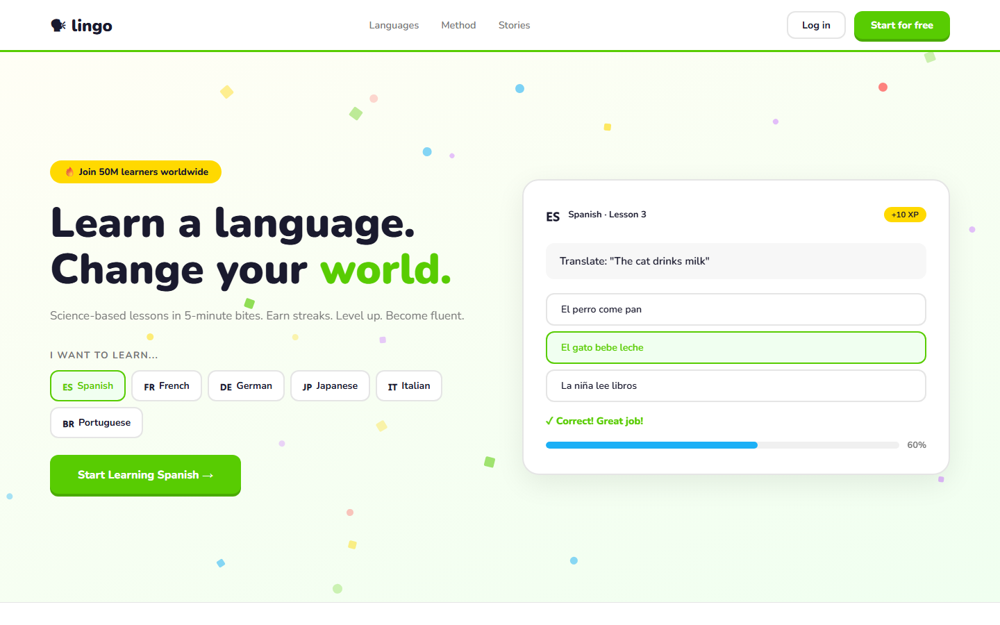

# Lingo - Learn Any Language



A responsive static landing page for Lingo learn any language, centered around the hero message: "Learn a language. Change your world."

## Quick Start

Open `index.html` in your browser.

```bash
# Windows PowerShell
start index.html
```

## Project Structure

```text
language-app/
|-- index.html
|-- style.css
|-- script.js
|-- screenshot.png
`-- README.md
```

## Features

- Adaptive Learning
- Leaderboards
- Native Audio
- Speaking Practice

## Tech Stack

- HTML5
- CSS3
- JavaScript
