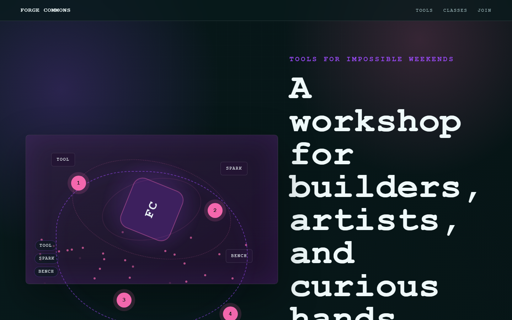

# Forge Commons - Makerspace



A practical makerspace page for tool access, classes, fabrication bays, and member projects.

## Quick Start

Open `index.html` in your browser.

```bash
# Windows PowerShell
start index.html
```

## Project Structure

```text
makerspace/
|-- index.html
|-- style.css
|-- script.js
|-- screenshot.png
`-- README.md
```

## Features

- CNC and laser labs
- Woodshop access
- Electronics benches
- Member build nights

## Tech Stack

- HTML5
- CSS3
- JavaScript
