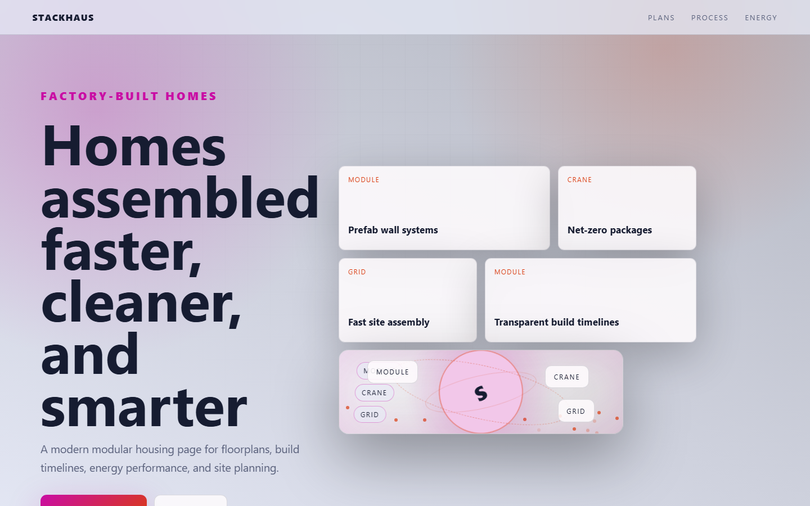

# StackHaus - Modular Housing



A modern modular housing page for floorplans, build timelines, energy performance, and site planning.

## Quick Start

Open `index.html` in your browser.

```bash
# Windows PowerShell
start index.html
```

## Project Structure

```text
modular-housing/
|-- index.html
|-- style.css
|-- script.js
|-- screenshot.png
`-- README.md
```

## Features

- Prefab wall systems
- Net-zero packages
- Fast site assembly
- Transparent build timelines

## Tech Stack

- HTML5
- CSS3
- JavaScript
