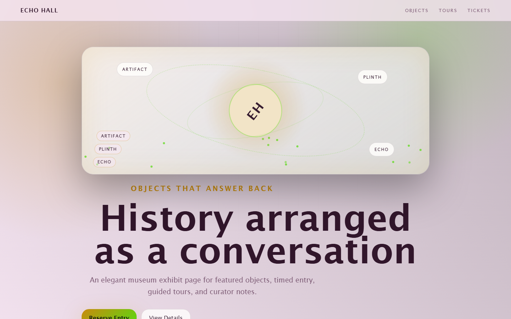

# Echo Hall - Museum Exhibit



An elegant museum exhibit page for featured objects, timed entry, guided tours, and curator notes.

## Quick Start

Open `index.html` in your browser.

```bash
# Windows PowerShell
start index.html
```

## Project Structure

```text
museum-exhibit/
|-- index.html
|-- style.css
|-- script.js
|-- screenshot.png
`-- README.md
```

## Features

- Interactive object labels
- Curator audio notes
- Guided school tours
- Evening member previews

## Tech Stack

- HTML5
- CSS3
- JavaScript
