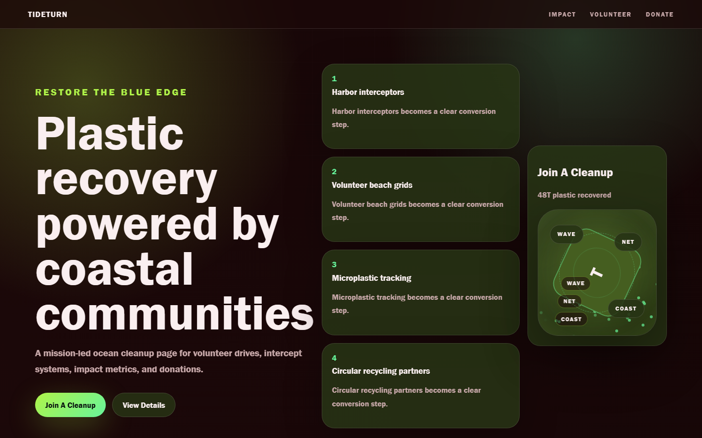

# TideTurn - Ocean Cleanup



A mission-led ocean cleanup page for volunteer drives, intercept systems, impact metrics, and donations.

## Quick Start

Open `index.html` in your browser.

```bash
# Windows PowerShell
start index.html
```

## Project Structure

```text
ocean-cleanup/
|-- index.html
|-- style.css
|-- script.js
|-- screenshot.png
`-- README.md
```

## Features

- Harbor interceptors
- Volunteer beach grids
- Microplastic tracking
- Circular recycling partners

## Tech Stack

- HTML5
- CSS3
- JavaScript
