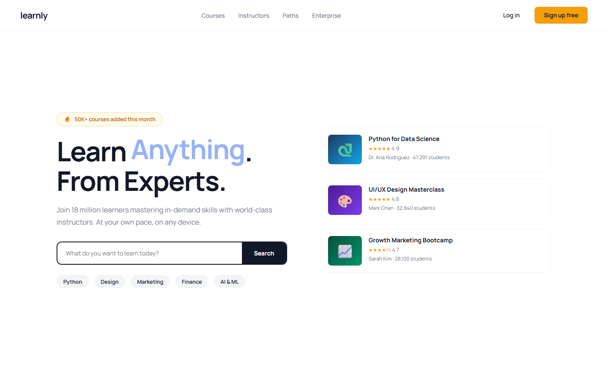

# Learnly - Master Any Skill



A responsive static landing page for Learnly master any skill, centered around the hero message: "Learn Anything . From Experts."

## Quick Start

Open `index.html` in your browser.

```bash
# Windows PowerShell
start index.html
```

## Project Structure

```text
online-course/
|-- index.html
|-- style.css
|-- script.js
|-- screenshot.png
`-- README.md
```

## Features

- Python for Data Science
- UI/UX Design Masterclass
- Growth Marketing Bootcamp

## Tech Stack

- HTML5
- CSS3
- JavaScript
