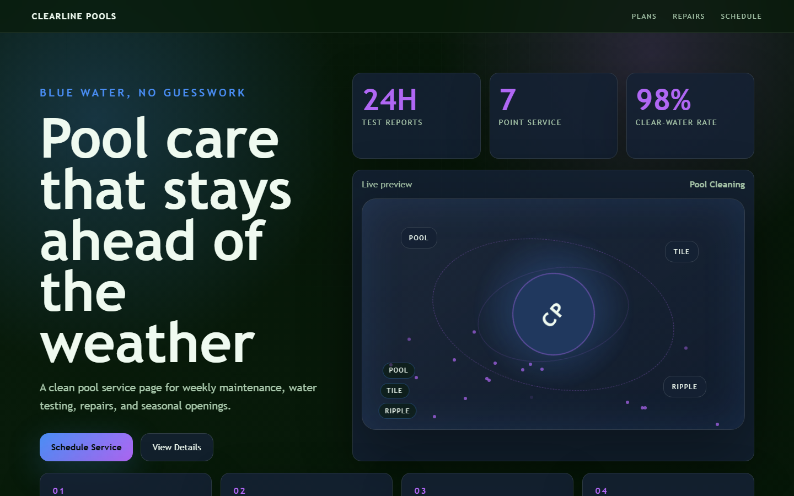

# Clearline Pools - Pool Cleaning



A clean pool service page for weekly maintenance, water testing, repairs, and seasonal openings.

## Quick Start

Open `index.html` in your browser.

```bash
# Windows PowerShell
start index.html
```

## Project Structure

```text
pool-cleaning/
|-- index.html
|-- style.css
|-- script.js
|-- screenshot.png
`-- README.md
```

## Features

- Weekly water balance
- Filter inspections
- Storm recovery visits
- Opening and closing plans

## Tech Stack

- HTML5
- CSS3
- JavaScript
