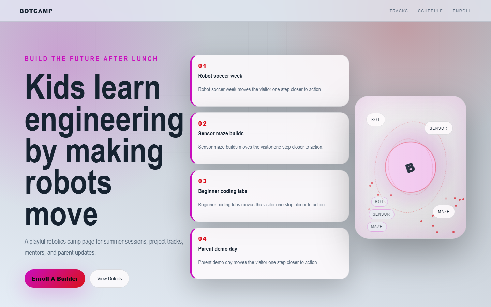

# BotCamp - Robotics Camp



A playful robotics camp page for summer sessions, project tracks, mentors, and parent updates.

## Quick Start

Open `index.html` in your browser.

```bash
# Windows PowerShell
start index.html
```

## Project Structure

```text
robotics-camp/
|-- index.html
|-- style.css
|-- script.js
|-- screenshot.png
`-- README.md
```

## Features

- Robot soccer week
- Sensor maze builds
- Beginner coding labs
- Parent demo day

## Tech Stack

- HTML5
- CSS3
- JavaScript
