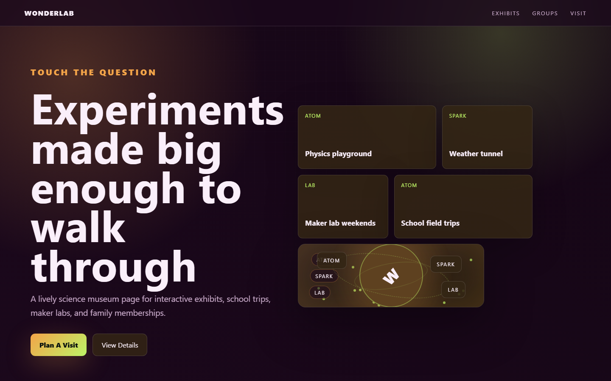

# WonderLab - Science Museum



A lively science museum page for interactive exhibits, school trips, maker labs, and family memberships.

## Quick Start

Open `index.html` in your browser.

```bash
# Windows PowerShell
start index.html
```

## Project Structure

```text
science-museum/
|-- index.html
|-- style.css
|-- script.js
|-- screenshot.png
`-- README.md
```

## Features

- Physics playground
- Weather tunnel
- Maker lab weekends
- School field trips

## Tech Stack

- HTML5
- CSS3
- JavaScript
