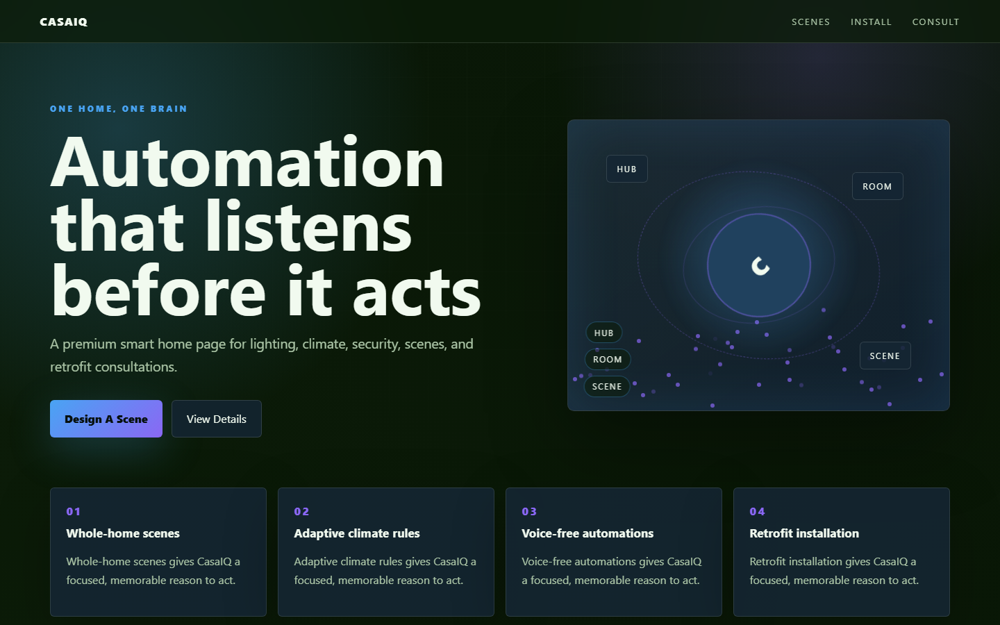

# CasaIQ - Smart Home Systems



A premium smart home page for lighting, climate, security, scenes, and retrofit consultations.

## Quick Start

Open `index.html` in your browser.

```bash
# Windows PowerShell
start index.html
```

## Project Structure

```text
smart-home/
|-- index.html
|-- style.css
|-- script.js
|-- screenshot.png
`-- README.md
```

## Features

- Whole-home scenes
- Adaptive climate rules
- Voice-free automations
- Retrofit installation

## Tech Stack

- HTML5
- CSS3
- JavaScript
