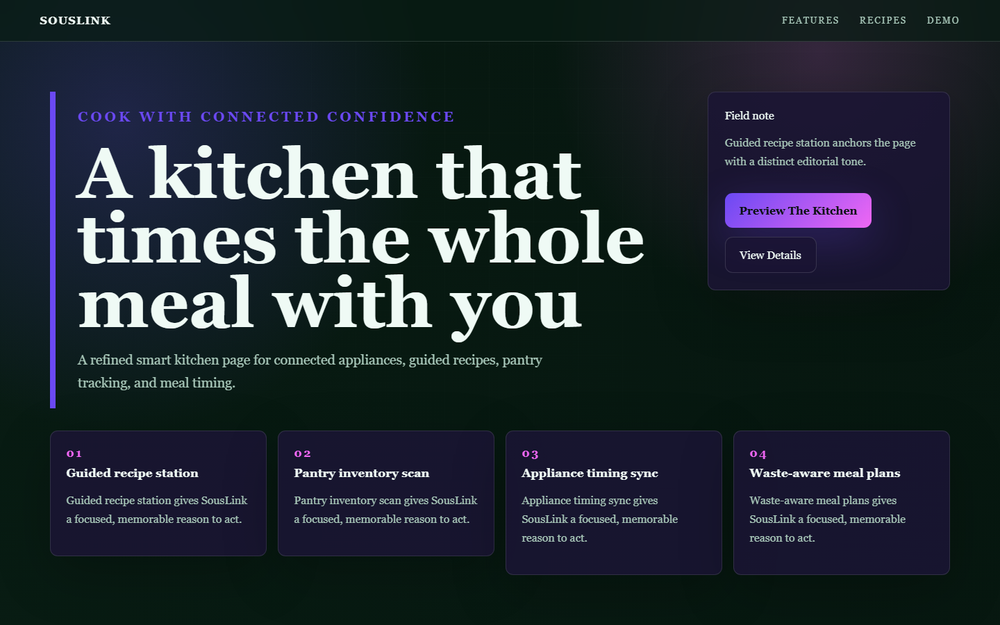

# SousLink - Smart Kitchen



A refined smart kitchen page for connected appliances, guided recipes, pantry tracking, and meal timing.

## Quick Start

Open `index.html` in your browser.

```bash
# Windows PowerShell
start index.html
```

## Project Structure

```text
smart-kitchen/
|-- index.html
|-- style.css
|-- script.js
|-- screenshot.png
`-- README.md
```

## Features

- Guided recipe station
- Pantry inventory scan
- Appliance timing sync
- Waste-aware meal plans

## Tech Stack

- HTML5
- CSS3
- JavaScript
