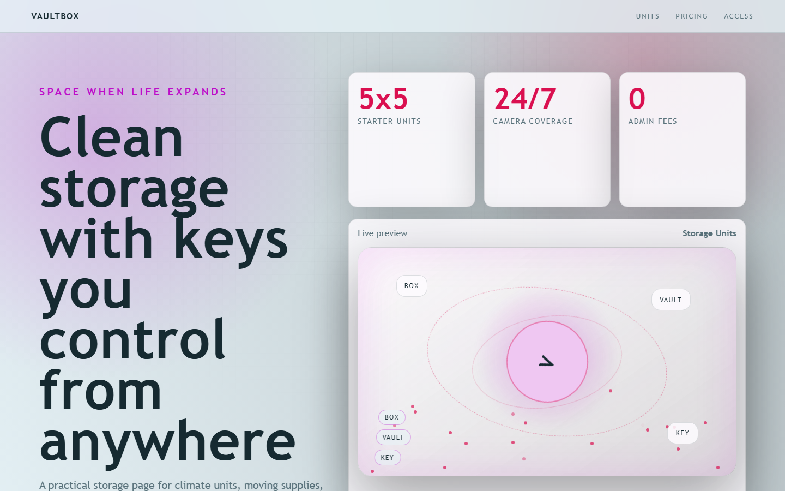

# VaultBox - Storage Units



A practical storage page for climate units, moving supplies, access control, and transparent pricing.

## Quick Start

Open `index.html` in your browser.

```bash
# Windows PowerShell
start index.html
```

## Project Structure

```text
storage-units/
|-- index.html
|-- style.css
|-- script.js
|-- screenshot.png
`-- README.md
```

## Features

- Climate-controlled units
- Mobile gate access
- Month-to-month pricing
- Moving supply pickup

## Tech Stack

- HTML5
- CSS3
- JavaScript
