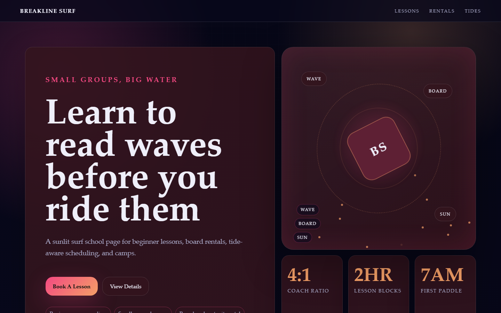

# Breakline Surf - Surf School



A sunlit surf school page for beginner lessons, board rentals, tide-aware scheduling, and camps.

## Quick Start

Open `index.html` in your browser.

```bash
# Windows PowerShell
start index.html
```

## Project Structure

```text
surf-school/
|-- index.html
|-- style.css
|-- script.js
|-- screenshot.png
`-- README.md
```

## Features

- Beginner wave reading
- Small group lessons
- Board and wetsuit rental
- Kids summer camps

## Tech Stack

- HTML5
- CSS3
- JavaScript
