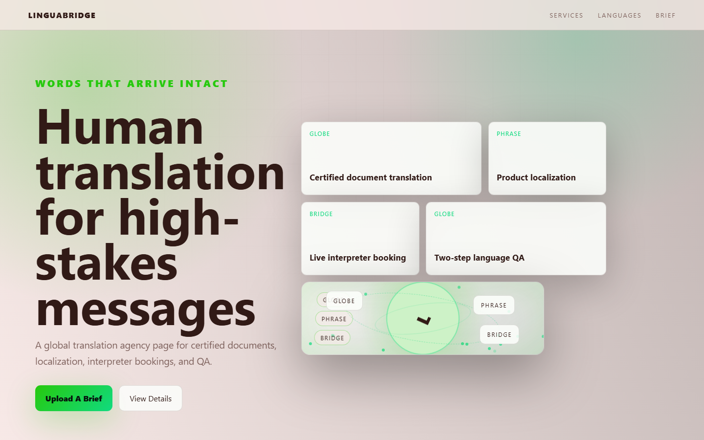

# LinguaBridge - Translation Agency



A global translation agency page for certified documents, localization, interpreter bookings, and QA.

## Quick Start

Open `index.html` in your browser.

```bash
# Windows PowerShell
start index.html
```

## Project Structure

```text
translation-agency/
|-- index.html
|-- style.css
|-- script.js
|-- screenshot.png
`-- README.md
```

## Features

- Certified document translation
- Product localization
- Live interpreter booking
- Two-step language QA

## Tech Stack

- HTML5
- CSS3
- JavaScript
