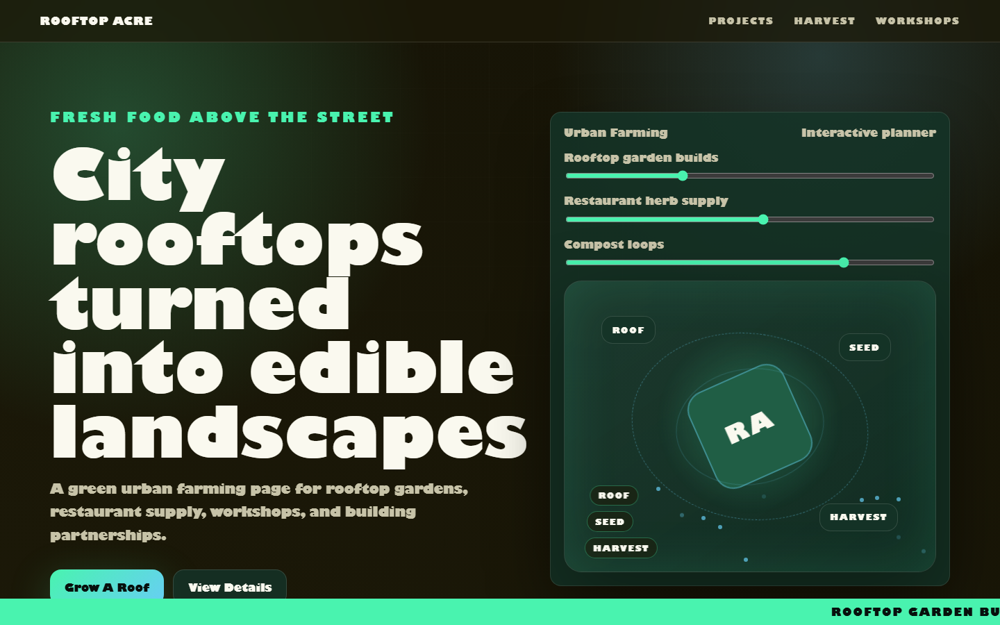

# Rooftop Acre - Urban Farming



A green urban farming page for rooftop gardens, restaurant supply, workshops, and building partnerships.

## Quick Start

Open `index.html` in your browser.

```bash
# Windows PowerShell
start index.html
```

## Project Structure

```text
urban-farming/
|-- index.html
|-- style.css
|-- script.js
|-- screenshot.png
`-- README.md
```

## Features

- Rooftop garden builds
- Restaurant herb supply
- Compost loops
- Resident workshops

## Tech Stack

- HTML5
- CSS3
- JavaScript
