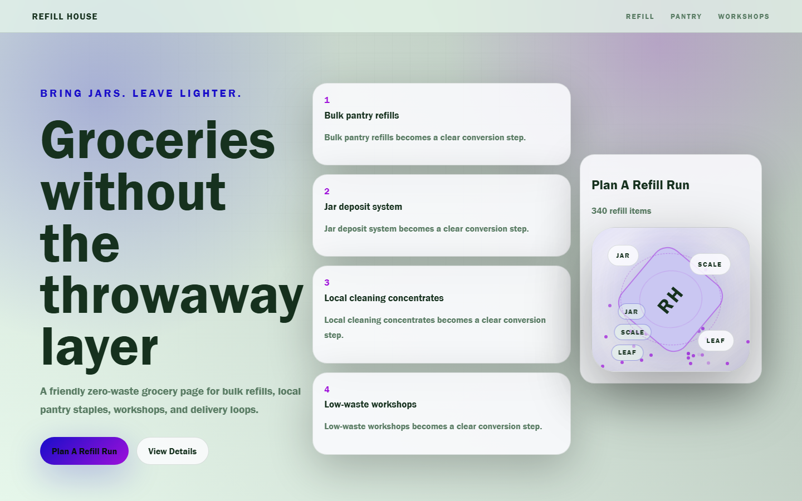

# Refill House - Zero Waste Grocery



A friendly zero-waste grocery page for bulk refills, local pantry staples, workshops, and delivery loops.

## Quick Start

Open `index.html` in your browser.

```bash
# Windows PowerShell
start index.html
```

## Project Structure

```text
zero-waste-grocery/
|-- index.html
|-- style.css
|-- script.js
|-- screenshot.png
`-- README.md
```

## Features

- Bulk pantry refills
- Jar deposit system
- Local cleaning concentrates
- Low-waste workshops

## Tech Stack

- HTML5
- CSS3
- JavaScript
